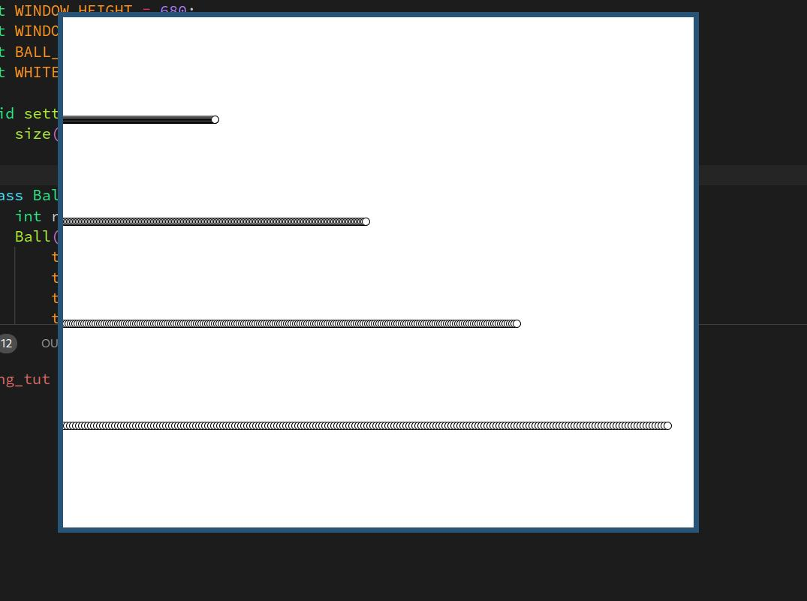

# Processing example

Simple example for Java processing example using OOP.

The code in Four_balls.pde is for creating a simple visualisation of 5 balls moving from one side to another in 5 differrent speeds.
Created using OOP fashion.

### Demo

